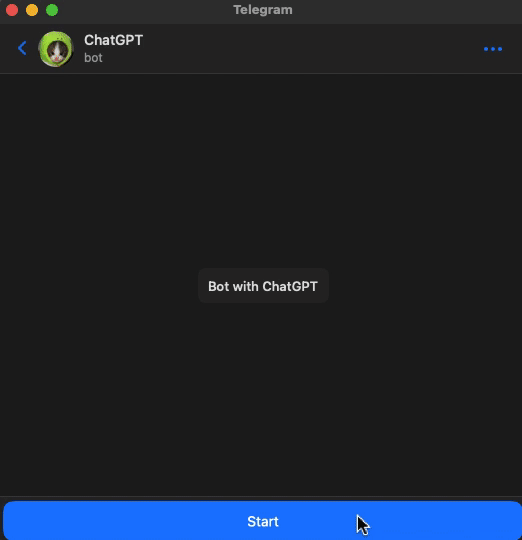

# NodeJS Chatbot with GPT-3 

This is a simple NodeJS Telegram chatbot application that uses the GPT-3 API to provide conversational responses.
<p align="center">
  
</p>

## Installation

1. Use `yarn install` to install dependencies
2. Get your [API key](https://platform.openai.com/account/api-keys) and [Telegram Bot Token](https://t.me/BotFather)
3. Set them into `docker-compose.yml` file: 
    ```bash
    environment:
      ChatGPT_API_KEY: ''
      BOT_TOKEN: ''
      ```
4. Alternatively, you can run the application using Docker:

```bash
    docker-compose up -d --build
```

## Usage 

This bot uses the ChatGPT-3 AI API for its work. He is able to take into account the context of previous messages and conduct a conversation. Note that in order to save the consumption of tokens used when generating a message, the bot remembers only 10 messages: 5 of its own and 5 of the user. This amount can be configured in `db.ts`.

Feel free to use your imagination and come up with your own prompts or questions to engage with ChatGPT!
